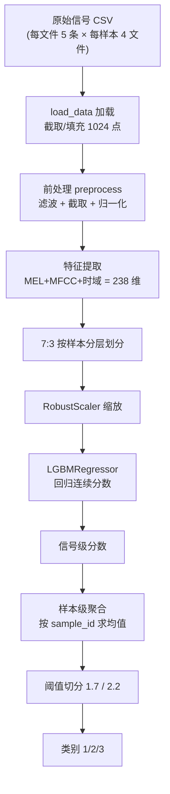

# 训练与模型说明

> 训练侧统一说明：数据、特征、模型（回归 + 有序分类）、调参参考。
> 代码：`fqb/train/` 包（`config` / `preprocess` / `features` / `data` / `selection` / `screening` / `model` / `ordinal` / `pipeline`）
> 任务：榴莲成熟度**三分类**（1=生果 / 2=中间果 / 3=熟果）
> 数据：`data_0830`（307 样本 / 6140 信号，每样本 4 文件 × 每文件 5 条信号）

---

## 1. 总体架构

模型有两种模式，共享同一套数据加载与特征提取：

1. **回归 + 阈值切分**（默认，`pipeline.main`）：`LGBMRegressor` 输出连续分数 → 样本级均值 → 阈值 1.7/2.2 切成三类；
2. **有序分类**（`train/ordinal.py`）：两个 `LGBMClassifier` 二分类器 P(y≥2)/P(y≥3) 累积概率决策，**无需人工调阈值**。

回归版数据流：



---

## 2. 数据与划分

### 2.1 数据加载（`data.load_data`）

| 步骤 | 逻辑 |
|------|------|
| 文件扫描 | 遍历数据目录下所有 `.csv`，排除 `label` 文件，按 `样本ID_文件序号` 排序 |
| 标签映射 | 读 `label.csv`，`to_numeric` 自动跳空行/非法行，按 sample_id 一一对应 |
| 信号读取 | 每个文件逐行读信号：跳过全零行，截取/填充到 **1024 点**，每文件最多取 **5 条** |
| 输出 | `X(N,1024)` 信号矩阵、`groups(N)` 样本ID、`y(N)` 标签 |

### 2.2 划分参数（`config`）

| 参数 | 当前值 | 含义 | 调参建议 |
|------|--------|------|----------|
| `SR` | 16000 | 采样率（Hz），由采集硬件决定 | **不要改**，改了所有频域特征尺度全变 |
| `FILES_PER_SAMPLE` | 4 | 每样本敲击文件数 | 与采集流程一致，勿改 |
| `SIGNALS_PER_FILE` | 5 | 每文件最多取 5 条信号 | 与采集流程一致，勿改 |
| `TEST_SIZE` | 0.3 | 测试集占比（0.3 = 训练70%:测试30%） | 小样本建议 0.2~0.3；样本越少越该偏 0.3 |
| `SEED` | 42 | 随机种子 | 保持固定，保证可复现 |

划分采用 `StratifiedShuffleSplit`，按 **sample_id（而非信号）** 分层，保证类别比例一致，且同一榴莲的 20 条信号永远在同一侧（**不泄漏**）。

---

## 3. 预处理（`preprocess.preprocess`，逐信号）

对每条 1024 点信号依次做 4 步：

| 步骤 | 参数 | 作用 |
|------|------|------|
| ① 带通滤波 | 50~4000 Hz，4 阶巴特沃斯，`filtfilt` 零相位 | 去掉工频与高频噪声，保留敲击声有效频段 |
| ② 截取 | `x[200:800]`，1024→600 点 | 去掉首尾静音/边沿，聚焦有效起振段 |
| ③ 去均值 | `x - mean(x)` | 消除直流偏置 |
| ④ 幅度归一化 | 除 std、再除 max(abs) | 消除采集增益差异，统一尺度 |

预处理参数：

| 参数 | 当前值 | 调参建议 |
|------|--------|----------|
| `bandpass_filter: low/high` | 50 / 4000 Hz | 与特征 `fmin/fmax` 保持一致；若有效信息在更高频，同步放宽两者 |
| `order` | 4 | 阶数越高滚降越陡但振铃越重；4 阶是通用平衡点 |
| `x[200:800]` | 1024→600 点 | 若信号起振点靠前/靠后，可平移窗口 |

---

## 4. 特征提取（`features.extract_features`，238 维）

对预处理后的 600 点信号提取三类特征：

| 特征块 | 计算方式 | 维度 |
|--------|----------|------|
| MEL 谱 | `melspectrogram(n_mels=64, n_fft=256, hop=64, fmin=50, fmax=4000)` → dB，取每频带 mean/std/max | 64×3 = **192** |
| MFCC | `mfcc(n_mfcc=20, n_fft=256, hop=64)`，取每系数 mean/std | 20×2 = **40** |
| 时域统计 | mean / std / max / min / ptp / rms | **6** |

合计：`192 + 40 + 6 = 238 维`

特征参数：

| 参数 | 当前值 | 含义 | 调参建议 |
|------|--------|------|----------|
| `n_mels` | 64 | 梅尔滤波器组数量 | 增大→频率分辨率更细但更易过拟合 |
| `fmin / fmax` | 50 / 4000 | 梅尔频带范围 | 与 bandpass 保持一致 |
| `n_fft` | 256 | STFT 窗长（256/16000=16ms） | 600 点可得 6 帧 |
| `hop_length` | 64 | 帧移（4ms，75% 重叠） | 600 点可得 6 帧 |
| `n_mfcc` | 20 | MFCC 系数个数 | 可试 13~40 |

> ✅ **帧数陷阱（已修复）**：600 点信号在 n_fft=256/hop=64 下可得 **6 帧**，std/max 反映时变动态。修复前 n_fft=512/hop=256 只有 1 帧，MEL std / MEL max / MFCC std 共 148 维退化为无用特征（std 恒 0）。

---

## 5. 回归模型（LGBMRegressor + 阈值）

### 5.1 模型架构（`model.build_model`）

```
Pipeline:
  ├── RobustScaler          # 用中位数/四分位距缩放，抗异常值
  └── LGBMRegressor         # 回归连续成熟度分数
```

`LGBMRegressor` 参数：

| 参数 | 值 | 作用一句话 |
|------|-----|-----------|
| `objective` | regression_l2 | 平方损失（L2），精确拟合分数 |
| `n_estimators` | 150 | 树的总数 |
| `learning_rate` | 0.03 | 每棵树贡献的缩水系数 |
| `num_leaves` | 8 | 每棵树最大叶子数（复杂度主控） |
| `max_depth` | 4 | 每棵树深度上限 |
| `min_child_samples` | 40 | 每片叶子最少样本数（防过拟合关键） |
| `subsample` | 0.8 | 行采样 80% |
| `colsample_bytree` | 0.8 | 列采样 80% |
| `reg_alpha` | 1.0 | L1 正则 |
| `reg_lambda` | 10.0 | L2 正则 |
| `random_state` | 42 | 随机种子 |

### 5.2 参数详解

**`objective="regression_l2"`**：决定"预测错多少怎么度量"。平方损失对离群标签敏感；若发现类别 2 误判与少数标错样本有关，可换 `huber`（L1/L2 折中）或 `regression_l1`（最鲁棒）。

**`n_estimators=150`**：树越多拟合越强，150 棵配小学习率已足够收敛；对仅 214 个训练样本，再多就死记训练集。**过拟合优先下调它**。

**`learning_rate=0.03`**：每棵树贡献乘此系数，小学习率泛化更好但需更多树。0.03 偏小，与 250 棵树配套。

**`num_leaves=8`**：叶子数直接控制复杂度。8 对 214 样本是保守选择；**过拟合第一优先下调**。

**`max_depth=4`**：限制单树最深 4 层，与 `num_leaves` 配套（深度 4 最多容纳 16 叶）。

**`min_child_samples=40`**：每叶至少 40 条信号 ≈ 2 个样本（每样本 20 信号），防"背"个别样本。

**`subsample=0.8`**：每棵树只用 80% 样本，降低方差、提升泛化。

**`colsample_bytree=0.8`**：每棵树只用 80% 特征，避免过度依赖少数强特征。

**`reg_alpha=1.0`（L1）**：倾向把不重要权重压成 0，隐式特征选择。

**`reg_lambda=10.0`（L2）**：抑制权重过大，**小样本防过拟合最直接有效**；仍过拟合可增到 15~20。

**`random_state=42`**：固定随机抽样，保证可复现。

### 5.3 分类阈值（最关键的经验参数）

| 参数 | 当前值 | 含义 |
|------|--------|------|
| `THRESH_1_2` | 1.7 | 分数 < 1.7 判为 1 级（生果） |
| `THRESH_2_3` | 2.2 | 分数 ≥ 2.2 判为 3 级（熟果），之间为 2 级 |

> **本项目最重要的教训**：阈值必须在真实预测数据上校准，不能只看训练集。训练 OOF 最优阈值是 1.5/2.5，但预测集最优是 1.8/2.6——存在系统偏移。调法：画出预测集分数分布，按各类别分数分位点选阈值；中间果（2 级）与两端重叠越多，准确率上限越低。
>
> 诊断结论：小样本下阈值校准不可靠，故引入**有序分类**（第 6 节）从根上消除阈值依赖。

### 5.4 后处理

- **样本级聚合**（`model.aggregate_by_sample`）：信号级分数 → 按 `sample_id` 求均值。
- **阈值切分**（`model.score_to_class`）：`<1.7→1`，`<2.2→2`，否则→3。

### 5.5 完整数据流（端到端）

| 阶段 | 输入 → 输出 | 形状 |
|------|-------------|------|
| 加载 | CSV → 信号矩阵 | `(6140, 1024)` |
| 前处理 | 原始信号 → 干净信号 | `(6140, 600)` |
| 特征提取 | 干净信号 → 特征向量 | `(6140, 238)` |
| 划分 | 全量 → 训练/测试 | ~4280 / ~1860 信号 |
| 回归 | 特征 → 连续分数 | `(6140,)` |
| 聚合 | 信号级分数 → 样本级分数 | `(307,)` |
| 切分 | 样本级分数 → 类别 | `(307,)` 取值 1/2/3 |

---

## 6. 有序分类（Ordinal，`train/ordinal.py`）

### 6.1 为什么

诊断（见《预测与训练问题分析.md》第十五章）：样本加权无效、阈值校准在小样本下不稳定。**根因**：标签 1/2/3 是**有序离散类别**（1<2<3），不是等距连续值，"回归 + 固定阈值"把有序类别硬压成连续轴，阈值必须人工设定且极不稳定。

### 6.2 原理

用两个二分类器对有序标签建模：

| 分类器 | 学习目标 | 含义 |
|--------|----------|------|
| `clf2` | P(y ≥ 2) | 生果(1) vs 中间果+熟果(2,3) |
| `clf3` | P(y ≥ 3) | 生果+中间果(1,2) vs 熟果(3) |

决策规则（阈值 0.5 天然确定，无需人工调）：

```python
p2 = P(y >= 2),  p3 = P(y >= 3)
p3 = min(p3, p2)          # 单调性修复：两个独立分类器概率可能违反 p3 <= p2
if   p2 < 0.5:  → 1 级
elif p3 < 0.5:  → 2 级
else:           → 3 级
```

> **单调性修复是关键**：`clf2`、`clf3` 独立训练，可能出现 `P(y>=3) > P(y>=2)` 的逻辑矛盾，必须 `p3 = min(p3, p2)` 修正。

### 6.3 模型架构

两个结构相同的 `LGBMClassifier` 二分类器（低复杂度 + 强正则）：`objective=binary`，`n_estimators=150`，`learning_rate=0.05`，`num_leaves=8`，`max_depth=3`，`min_child_samples=40`，`subsample=0.8`，`colsample_bytree=0.8`，`reg_alpha=1.0`，`reg_lambda=10.0`。每个分类器前接 `RobustScaler`。

**特征复用**：直接复用 `data.load_data` / `features.extract_features` / `model.stratified_split`，与回归版特征完全一致（238 维）。

### 6.4 效果对比（data_0830，7:3 划分）

| 指标 | 回归 + 阈值 | 有序分类 |
|------|------------|----------|
| 训练集准确率 | 86.5% | **92.5%** |
| 测试集准确率 | 77.4% | **79.6%**（+2.2） |
| 类别 2 训练 recall | 31% | **66%** |
| 类别 2 测试 recall | 47% | 40% |
| 类别 3 测试 recall | 76% | **82%** |
| 是否需要人工调阈值 | 需要（且不稳定） | **不需要** |

**结论**：测试集总体 +2.2 个点，且完全消除阈值校准负担；类别 2 训练 recall 从 31% 跃升到 66%（学习能力更强，测试 recall 略降因测试集仅 15 个类别 2 样本）。类别 2 与两端声学重叠的物理上限依然存在，非模型问题。

### 6.5 使用

```bash
# 有序分类训练（模型归档到 results/train_ordinal/<时间戳>/）
python train_ordinal.py
```

产物：`results/train_ordinal/<时间戳>/model.pkl`（`{"clf2": ..., "clf3": ...}`）+ `val_result.csv`。

---

## 7. 调参速查

| 现象 | 优先调整 | 方向 |
|------|----------|------|
| 训练高、测试低（过拟合，主问题） | `min_child_samples`、`reg_lambda`、`num_leaves`、`n_estimators` | 增大正则、减小复杂度 |
| 训练和测试都低（欠拟合） | `num_leaves`、`n_estimators`、`learning_rate` | 增大容量 |
| 中间果大面积误判 | `THRESH_1_2` / `THRESH_2_3` | **在预测集分数上重新校准阈值**（而非调模型） |
| 少数类被淹没 | 阈值 + 样本加权 | 在阈值附近放宽少数类区间 |
| 结果每次不一样 | `SEED`、`random_state` | 固定随机种子 |

**推荐顺序**：① 先调阈值（零成本，收益最大）→ ② 调正则与复杂度压制过拟合 → ③ 调 `n_estimators`/`learning_rate`。

**注意事项**：
- 小样本**不建议早停**（5 分类实验 `best_iter=1` 就停，退化全预测多数类）；
- 评估务必按样本分组，否则同一样本信号跨训练/测试集会虚高；
- 中间等级与两端声学重叠是**物理上限**，调参只能逼近、无法突破。

---

## 8. 代码结构与产物

### 8.1 `train/` 包结构

| 模块 | 职责 |
|------|------|
| `config.py` | 参数常量（路径/阈值/权重/模型参数，唯一真源） |
| `preprocess.py` | 滤波、包络、PSD、瞬态指标 |
| `features.py` | 声学特征提取（`extract_features` 等） |
| `data.py` | 数据加载（`load_data` / `load_dataset_structured`） |
| `selection.py` | 代表性敲击选择（`select_representative`） |
| `screening.py` | 离群筛选（样本级 + 信号级） |
| `model.py` | 模型/聚合/报告/分层划分 |
| `ordinal.py` | 有序分类（两个二分类器） |
| `pipeline.py` | 训练主流程（`main` / `run_curriculum`） |

### 8.2 输出产物

| 文件 | 说明 |
|------|------|
| `results/train/<时间戳>/model.pkl` | 回归 Pipeline 模型 |
| `results/train/<时间戳>/val_result.csv` | 测试集逐样本分数/真实类/预测类 |
| `results/train/<时间戳>/selected_samples.csv` | 代表性敲击选择记录 |
| `results/train/<时间戳>/selection_diagnostics.csv` | 每次敲击评分明细 |
| `results/train/<时间戳>/screened_signals.csv` | 被筛选的离群信号 |
| `results/train_ordinal/<时间戳>/model.pkl` | 有序分类 bundle |
