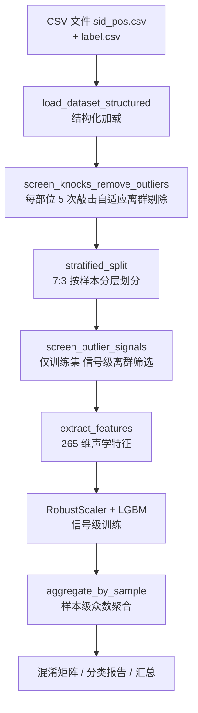

# 榴莲成熟度分类：训练策略与模型架构说明

> 脚本：`whg/train.py`（配套 `predict.py` / `predict_show.py`）
> 最后更新：2026-09-08

---

## 1. 项目概述

- **目标**：根据榴莲的敲击声学信号，判定成熟度等级。
- **标签**：三分类有序标签 `1=生果`、`2=中间果`、`3=熟果`（仅有序 `1<2<3`，非等距连续值）。
- **数据**：`data_all`，315 颗榴莲，每颗 4 个敲击部位 × 5 次敲击。
- **当前最优基线**：普通多分类（LGBMClassifier），测试集（95 颗）准确率 **82.11%**。

---

## 2. 数据说明

| 项 | 内容 |
|----|------|
| 数据目录 | `C:\Users\reemoon\Desktop\data_test\data_all` |
| 标签文件 | `data_all\label.csv`（315 行，按 sid 排序） |
| 文件命名 | `{sid}_{pos}.csv`，如 `021_01.csv`（021 号榴莲，01 部位） |
| 部位 | `01 / 02 / 03 / 04` 共 4 个 |
| 每文件信号 | 5 次敲击（每行一条，1024 点，16kHz 采样） |
| 类别分布 | 生果 124 / 中间果 85 / 熟果 106 |

---

## 3. 数据处理流程

### 3.1 结构化加载 `load_dataset_structured()`

- 读 `label.csv`（单列，自动跳空行），建立 `sid → label` 映射。
- 逐文件处理：
  - NaN/inf → 0；
  - 丢掉全 0 行；
  - 长度 >1024 截断、<1024 补零，统一到 1024 点。
- 返回 `{sid: {label, positions: {pos: array(K, 1024)}}}`。

### 3.2 敲击离群剔除 `screen_knocks_remove_outliers()`（自适应）

每部位 5 次敲击做离群分析，**只剔除明显异常**（数量 0~2 个不固定）：

1. `select_representative()` 计算每次敲击的 `anomaly_penalty`（异常惩罚）：
   - peak / crest 的 MAD 归一化 Z 分数超阈值部分；
   - 频谱相似度（归一化 PSD 与组中位数的余弦）低于阈值部分。
2. 自适应阈值：`th = max(组内中位数 + ANOM_MAD_K×MAD, ANOM_ABS_MIN)`，其中 `ANOM_MAD_K=3.0`、`ANOM_ABS_MIN=0.5`。
3. 只有 `anomaly_penalty > th` 才剔除，最多剔 `OUTLIER_REMOVE_N=2` 个、至少保留 `MIN_KNOCKS=3` 个。

> 目的：剔除明显异常的敲击（如双击、滑落、噪声），而不是机械地 5→3。

### 3.3 信号级离群筛选 `screen_outlier_signals()`（仅训练集）

筛选**离群信号**（非样本），只剔明显异常：

1. 每条信号计算梅尔频谱(dB)并展平；
2. 计算到训练集梅尔频谱中位数的平均距离 `mel_dist`；
3. 距离阈值（中位数 + `SIGNAL_MAD_K×MAD`，`SIGNAL_MAD_K=3.0`）与 DBSCAN 噪声**两路都命中**才剔除。

### 3.4 特征提取 `extract_features()`（265 维）

先对每条信号 `preprocess()`：带通滤波 50–700 Hz → 截取 `x[200:800]`（600 点）→ 去均值 → 标准差归一化 → 幅值归一化。

| 特征块 | 维度 | 说明 |
|--------|:---:|------|
| Mel 谱(dB) mean/std/max | 192 | `n_mels=64, fmin=50, fmax=4000, n_fft=256, hop=64` |
| MFCC mean/std | 40 | `n_mfcc=20` |
| 谱质心 / 带宽 / 滚降 / 平坦度 / 过零率 / RMS | 12 | 各取 mean/std |
| 谱对比度 mean | 7 | 7 个频段 |
| 频段能量比 mean/std | 6 | 低 50-500 / 中 500-2000 / 高 2000-4000 Hz |
| 时域统计 | 8 | mean/std/max/min/ptp/rms/skew/kurtosis |
| **合计** | **265** | |

---

## 4. 训练策略

### 4.1 数据划分

- `StratifiedShuffleSplit` 按 **sample_id（整颗榴莲）** 做 7:3 分层划分，`SEED=42`。
- 保证同一颗榴莲不会同时出现在训练集和测试集（防泄漏），且类别比例一致。

### 4.2 模型模式（三个开关）

| 开关 | 默认 | 说明 |
|------|:---:|------|
| `USE_CLASSIFIER` | `True` | 直接多分类 LGBMClassifier（当前基线） |
| `USE_ORDINAL` | `False` | 有序分类：两个二分类器累积概率决策 |
| （均关） | — | 回归 + 固定阈值（旧方案，已弃用） |

### 4.3 信号级训练 + 样本级聚合